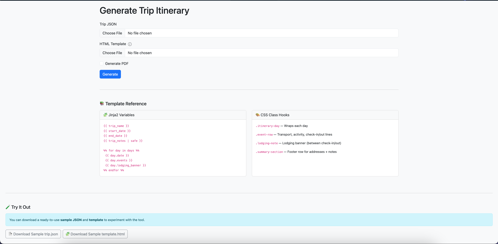
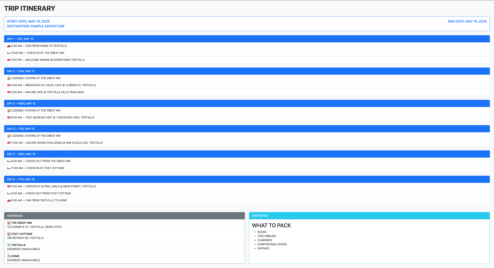

# 🧳 Surmai Itinerary Generator

> ⚠️ **No longer maintained.** [Surmai](https://github.com/rohitkumbhar/surmai) now generates PDF itineraries natively (since [#245](https://github.com/rohitkumbhar/surmai/pull/245), Dec 2025), which covers what this tool was built for. This repository is archived and kept for reference.

A web-based tool for rendering beautiful, print-ready trip itineraries from Surmai's `trip.json` exports using customizable Jinja2 + Bootstrap 5 templates. Supports optional PDF generation via [Gotenberg](https://github.com/gotenberg/gotenberg).


[](https://codecov.io/gh/Masked-Kunsiquat/itinerary-generator)


---

## 🧾 About Surmai

This project is inspired by [Surmai](https://github.com/rohitkumbhar/surmai), an alpha-stage travel organizer built by [@rohitkumbhar](https://github.com/rohitkumbhar). Surmai aims to:

* Enable collaborative trip planning
* Provide centralized access to travel artifacts
* Keep your data private and self-hosted

This tool extends Surmai by providing a polished export and print experience for your finalized trip plan.

> **Note:** Surmai is actively evolving — report bugs or ideas via its [GitHub Issues page](https://github.com/rohitkumbhar/surmai/issues).

---

## ✨ Features

* Upload a Surmai-style `trip.json`
* Upload your own Jinja2-compatible HTML template (Bootstrap 5+)
* Auto-fallback to a default built-in template
* View and download the rendered itinerary
* Optionally generate a print-ready PDF via Gotenberg
* Includes downloadable sample files and power-user documentation

---

## Screenshots

### UI Preview


### Exported HTML/PDF


---

## 🚀 Quick Start

### 🐳 Run from Docker Hub

Prefer not to build locally? Use the prebuilt image:

```bash
docker run --rm -p 5000:5000 maskedkunsiquat/itinerary-generator
```

> Uses a secure `python:alpine` base image
> **PDF export requires a running Gotenberg instance**

---

### ⚡ Full Stack with Docker Compose

For HTML + PDF generation:

```yaml
services:
  app:
    image: maskedkunsiquat/itinerary-generator:latest
    ports:
      - "5000:5000"
    depends_on:
      - gotenberg

  gotenberg:
    image: gotenberg/gotenberg:7
    ports:
      - "3000:3000"
```

Start it up:

```bash
docker-compose up -d
```

Visit: [http://localhost:5000](http://localhost:5000)

---

### 🏷️ Available Image Tags

| Tag      | Description                           |
| -------- | ------------------------------------- |
| `latest` | Actively maintained, secure           |
| `v1.0.1` | Stable, pinned production build       |
| `v1.0.0` | ⚠️ Deprecated — known vulnerabilities |

---

### 🔧 Build Manually (Optional)

```bash
git clone https://github.com/Masked-Kunsiquat/itinerary-generator.git
cd itinerary-generator
docker-compose up --build
```

---

## 📁 What to Upload

Required:

* `trip.json` — Surmai trip export
* `template.html` — (optional) your own Jinja2 + Bootstrap 5 layout

If no template is provided, `default-template.html` is used automatically.

---

## 🖨️ PDF Export via Gotenberg

When "Generate PDF" is checked:

* The rendered HTML is sent to Gotenberg
* A downloadable PDF is returned

All server-side, Gotenberg-compatible output. No client JS required.

---

## 🧑‍💻 Power Users: Templating & Theming

### 🧱 Common Jinja2 Variables

```jinja2
{{ trip_name }}
{{ start_date }} - {{ end_date }}
{{ trip_notes | safe }}


  {{ day.date }}
  {{ day.events }}
  {{ day.lodging_banner }}

```

### 🎨 Custom CSS

Drop your stylesheet in `/static/custom.css` and reference it:

```html
<link rel="stylesheet" href="/static/custom.css">
```

### 🏷️ Semantic Class Hooks

These can be used to theme or extend layouts:

| Class              | Description                                 |
| ------------------ | ------------------------------------------- |
| `.itinerary-day`   | Wraps a single day                          |
| `.event-row`       | Flight, check-in, or activity rows          |
| `.lodging-note`    | Light banner for nights with active lodging |
| `.summary-section` | Footer section with addresses & notes       |

---

## 🧪 Sample Files Included

To help you get started:

* [`trip.sample.json`](./static/trip.sample.json) — A fictional 5-day trip
* [`template.sample.html`](./static/template.sample.html) — Minimal Bootstrap 5 + Jinja2 template

Both are downloadable from the app UI.

---

## 🛠 Developer Setup (No Docker)

```bash
python3 -m venv .venv
source .venv/bin/activate
pip install -r requirements-dev.txt
python app.py
```

---

## 📦 Project Structure

```
.
├── app.py                  # Flask frontend
├── generate_itinerary.py   # Logic for Jinja2 + Gotenberg
├── default-template.html   # Used if no upload provided
├── static/
│   ├── trip.sample.json
│   ├── template.sample.html
│   └── custom.css          # Optional user theming
├── templates/
│   └── form.html           # Upload UI
├── Dockerfile / docker-compose.yaml
└── requirements-dev.txt
```

---

## 🔐 Technical Notes

* Flask runs in development mode by default
* Gotenberg uses `http://gotenberg:3000` internally (Docker bridge)
* Rendering is done server-side to ensure PDF consistency
* No client-side JS needed for templating

---

## 💡 Future Enhancements

Ideas and considerations for future contributors:

* 🌗 Dark mode or theme toggling
* 🧪 Template validation/linting for missing variables
* 🖼 Live previews of selected templates
* 💾 Local storage or cache of recent uploads
* 🧱 Partial-based templating (e.g. `day-card.html`)
* 📄 Select from multiple saved template styles
* 🔐 Basic auth or team access controls

> Pull requests welcome! Or fork it and make it your own ✨

---

## 📄 License

MIT — Free to use, modify, and adapt.

---

## 👤 Author

Created by **Masked-Kunsiquat**
Layout inspired by Pinegrow mockups and powered by ChatGPT
Originally built for Surmai trip exports
